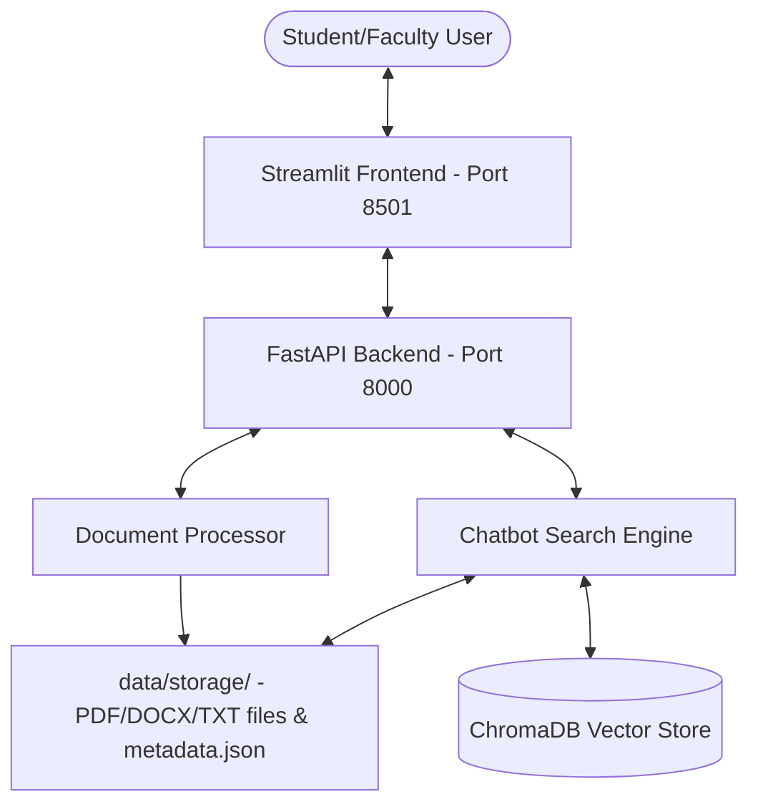

# Project Overview: Engineering Knowledge Retrieval Chatbot

This document details the project use cases, system architecture, market relevance, GitHub deployment configuration, and resume showcases.

---

## 1. Project Use Cases
* **Centralized Academic Hub**: Serves as a single repository for notes, syllabus outlines, previous year question papers, and lab manuals, eliminating fragmented storage across multiple student folders, emails, and drives.
* **Intelligent Discovery**: Enables students to find materials even if they don't know the exact filenames or matching keywords, searching instead by broader conceptual subjects.
* **Automated Study Summaries**: Generates high-level summaries of bulky PDF notes and manuals on demand, saving study preparation time.
* **Practical Roadmapping**: Automatically pairs academic search results with relevant engineering project ideas and execution roadmaps (curated by difficulty, phases, and learning resources) to promote hands-on project-based learning.

---

## 2. Technical Functioning & Architecture



* **Ingestion and In-Memory Text Extraction**: 
  When a document is uploaded via the Admin portal, the backend extracts the text dynamically using libraries like `PyPDF2` (for PDFs) and `python-docx` (for Word documents).
* **Vector Embeddings Creation**: 
  The extracted text is transformed into high-dimensional vector representations using the `sentence-transformers` model (`all-MiniLM-L6-v2`), capturing the conceptual meaning of the text.
* **Semantic Indexing**: 
  The generated vector embeddings are indexed and saved inside a local **ChromaDB** vector database instance.
* **Dual Hybrid Search Engine**: 
  When a search query is submitted, the system parallelly executes:
  1. A **Keyword Search**: Performs a frequency-based match on titles, subjects, and keywords.
  2. A **Semantic Search**: Searches the ChromaDB vector database using cosine similarity to find conceptually similar matches.
  
  The engine merges, deduplicates, and ranks these results, enforcing strict Department and Semester filters.
* **Extractive Summarizer**:
  Uses a word frequency scoring algorithm (TF-style scoring) to extract and display the top 5 sentences that contain the highest amount of information density from the document.

---

## 3. Market & Industry Impact
* **Adaptive EdTech Integration**: Standard educational software relies on static structures. This project introduces intelligent semantic grouping, allowing universities to dynamically map course content to learning materials.
* **Bridging Theory with Practice**: By correlating document topics with actual project roadmaps, the platform bridges the gap between class lectures and engineering application.
* **Corporate Knowledge Management Potential**: The same architecture can be deployed in software engineering, legal, or medical corporations to search internal compliance guidelines, APIs, and client documents.

---

## 4. GitHub Upload Guide (Repository Structure)

To upload this project to GitHub clean and correctly, configure your files as shown below.

### Files to Commit (Upload to GitHub)
```text
├── backend/
│   ├── main.py                # Core FastAPI endpoints (health, upload, search, summarize, etc.)
│   ├── database.py            # ChromaDB database handler
│   ├── chatbot_engine.py      # Keyword, Semantic, and Hybrid search logic
│   ├── document_processor.py  # File upload handlers and text extraction
│   ├── config.py              # Port, path, and size configurations
│   └── __init__.py
├── frontend/
│   ├── app.py                 # Streamlit UI Dashboard
│   └── ...
├── initialize.py              # DB initialization and sample document data
├── run_backend.py             # Uvicorn launcher
├── start_services.py          # Dual process launcher (Backend + Frontend)
├── START.bat                  # Windows startup batch script
├── start.sh                   # Linux/macOS startup bash script
├── requirements_packages.txt  # Python dependency list
├── requirements.txt           # Virtualenv-locked dependency list
├── README.md                  # Standard project setup guide
└── PROJECT_OVERVIEW.md        # This overview document
```

### Files to Ignore (Add to `.gitignore`)
Do NOT upload python binaries, virtual environments, database cache, or heavy uploads. Create a `.gitignore` file in the root containing:
```gitignore
# Virtual Environment
venv/
.env

# Python compilation cache
__pycache__/
*.py[cod]
*$py.class

# Local Database and User Uploads
data/chroma_db/
data/storage/*
!data/storage/PROJECT_TOPICS.json  # Keep the project ideas database!
```

---

## 5. Resume Showcases

### Project Title Suggestions
1. **AcademiaRAG**: *A Hybrid Semantic Search and Summarization Engine for Engineering Resource Hubs*
2. **AI-Powered Academic Knowledge Engine**: *RAG Chatbot using FastAPI, Streamlit, and ChromaDB*

### Short Description (Resume Bullet Points)
* Developed **AcademiaRAG**, a Retrieval-Augmented Generation (RAG) platform to centralize and manage academic study materials and project roadmaps across 8 engineering disciplines.
* Built a **Hybrid Search Engine** combining traditional keyword-based matching with vector-based semantic search using **ChromaDB** and `sentence-transformers` to deliver context-aware study material retrieval.
* Implemented a native extractive **summarization engine** using sentence-scoring word frequencies, reducing study preparation time by extracting key sentences from uploaded PDFs and DOCX files.
* Engineered a modular, robust REST API service using **FastAPI** coupled with a responsive, premium user interface using **Streamlit**, serving endpoints with full CORS middleware support.
